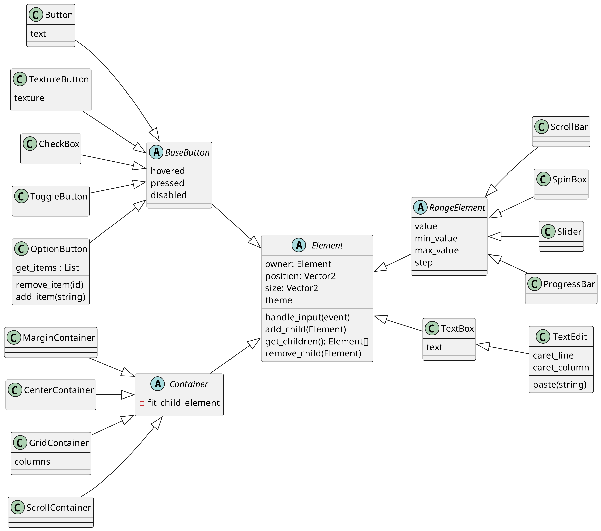

# SOLID Principles

## Author: Balan Artiom

----

## Objectives:

1. Study and understand the SOLID Principles.
2. Choose a domain, define its main classes/models/entities and choose the appropriate instantiation mechanisms.
3. Create a sample project that respects SOLID Principles.

## Used principles

1. The Single-responsibility principle
2. The Open–closed principle
3. The Liskov substitution principle
4. The Interface segregation principle (at least it wasn't violated)
5. The Dependency inversion principle

## Implementation

I've designed a GUI library. Here's the class diagram:

### Single responsibility

Even though the `Container` could take care of of margins and centering its content,
we&rsquo;ve put these features into separate classes.

### Open-closed

It&rsquo;s easy to add new GUI elements by inheriting from the appropriate class.
For example, we could add a date picker or color picker by inheriting from `Button`,
or add a search field by inheriting from `TextEdit`.

### Liskov substitution

A `ToggleButton` acts exactly like a button,
with the only difference that it looks differently and that it acts on button-down rather than button-up.

However, this doesn&rsquo;t really make a difference since we won&rsquo;t be passing UI objects as parameters anywhere.

### Interface segregation

It wasn&rsquo;t necessary here, since there isn&rsquo;t a class that&rsquo;s used by multiple &ldquo;clients&rdquo;.
The only relationship between objects is the parent-child relationship between of the `Element` class.

### Dependency inversion

We could make all the kinds of buttons inherit from `Button`.
Instead, I chose to make them inherit from an abstract `BaseButton`.
This is useful in case a button doesn&rsquo;t have any text, for example.
`BaseButton` won&rsquo;t change, whereas `Button` might change (e.g. to add a `keep_pressed_outside` property).

## Conclusions

